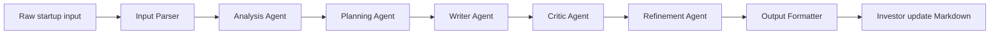

# Investor Update Automation Agent

A local-first autonomous agent that turns raw startup metrics, notes, wins, risks, and asks into an investor-ready update. The system is intentionally multi-stage: it parses input, analyzes trends, plans the message, writes a draft, critiques it, refines it, and formats a final Markdown update.

**Live demo:** [https://investor-update-automation-agent.onrender.com/](https://investor-update-automation-agent.onrender.com/)



## Quickstart

```bash
npm install
npm run demo
npm run dev
```

Open `http://localhost:3000` after starting the dev server.

## What It Includes

- Next.js, TypeScript, Tailwind, and shadcn-style UI components.
- Separate agent classes for parsing, analysis, planning, writing, critique, refinement, and formatting.
- Structured JSON passed between every stage.
- Trace logging for every stage, visible through the "Show agent steps" panel.
- Partial pipeline support with `runStage(stage, rawInput)` or API `stopAfter`.
- Local JSON storage for drafts and voice profiles in `.local-data/`.
- Markdown export from the browser.
- Deterministic mock LLM fixtures for demos and tests.
- Optional Ollama mode for local model experimentation.

## LLM Modes

The adapter API is:

```ts
generate(promptId, input, options) => { output, tokens, metadata }
```

Modes:

- `mock`: default, deterministic, no network, reads fixtures from `mock-responses/`.
- `ollama`: calls a local Ollama server at `OLLAMA_HOST` or `http://localhost:11434`.
- `api`: placeholder that throws until you implement your own provider.

Run with Ollama:

```bash
LLM_MODE=ollama OLLAMA_MODEL=llama3.2 npm run demo
```

No secrets are required for the default path.

## Demo And Tests

```bash
npm run demo
npm test
```

`npm run demo` loads `examples/growth-quarter.json`, executes all seven stages, prints the stage trace order, and emits the final Markdown update. `npm test` covers parser warnings, analysis trends, writer metric discipline, and deterministic full-pipeline output.

## Deployment

The public demo is deployed on Render using the checked-in `render.yaml` Blueprint. It runs in deterministic `mock` mode, so visitors can use the full pipeline without API keys, paid services, or secrets.

Render build command:

```bash
npm ci && npm run build
```

Render start command:

```bash
npm run start:render
```

## Mock Determinism

The deterministic mock adapter always returns the same fixture for a prompt id from `mock-responses/`. The production stage classes still compute final content from the structured input, so example outputs remain stable while proving the LLM interface can be swapped. Tests compare full final Markdown against files in `examples/expected/`.

## Prompt Templates

Prompt templates live in `prompts/`. Each template includes:

- `id`
- `role`
- `instructions`
- `input_schema`
- `output_schema`
- `examples`

The templates explicitly require no hallucinated metrics and clear separation of fact versus interpretation.

## Repository Layout

```text
src/lib/agents       Stage classes
src/lib/llm          Mock, Ollama, and placeholder API adapters
src/lib/pipeline.ts  Orchestration, traces, partial stage runs
src/app/api          Next.js API routes
src/components       Dashboard and shadcn-style UI
prompts              Prompt templates
mock-responses       Deterministic LLM fixtures
examples             Raw inputs and expected Markdown
tests                Unit and integration tests
```

## Future Improvements

- Add schema-constrained local model retries for Ollama JSON repair.
- Add richer diff visualization with section-level scoring.
- Add draft history search and named collections.
- Add PDF export and email-ready copy blocks.
- Add more voice profiles for board updates, seed investors, and monthly internal operating reviews.
